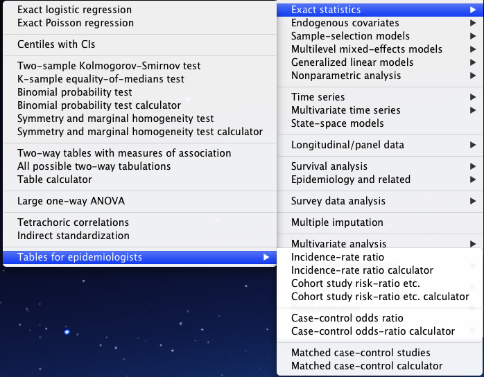

---
title       : Introduction to Radyant
subtitle    : Marketing analytics using Shiny
author      : Vincent Nijs
job         : Assistant Professor of Marketing, Rady School of Management, UCSD
framework 	: impressjs
widgets     : [mathjax]     # {mathjax, quiz, bootstrap}
highlighter : highlight.js  # {highlight.js, prettify, highlight}
mode  			: selfcontained


```{r, eval=TRUE, echo=FALSE}
# Block 1
x <- 0; x.incr <- 700
y <- 0; y.incr <- 700
```

--- #title x:`r x-x.incr` y:`r y-y.incr`

__Introduction to Radyant__<br>
_Marketing analytics using Shiny_

#### Credits

* [Rady](http://rady.ucsd.edu)
* [Radyant code](http://github.com/mostly-harmless/radyant)
* [Presentation](http://github.com/mostly-harmless.github.io)
* [Slidify](http://www.slidify.org)
* [impress.js](http://github.com/bartaz/impress.js)

--- #me x:`r x+x.incr` y:`r y-y.incr`

Vincent Nijs<br>
Assistant Professor of Marketing<br>
Rady school of Management, UCSD<br>
vnijs@rady.ucsd.edu

--- #mgt202 x:`r x-1.5*x.incr` y:`r y+y.incr`

At Rady I teach a class titled _Research for Marketing Decisions_ to 2nd year MBA students.

--- #spss x:`r x` y:`r y+y.incr`

For years I used SPSS. SPSS has many tools my students won't need and defaults that may not apply to applications in marketing.

--- #deducer x:`r x+1.5*x.incr` y:`r y+y.incr`

I wanted to use R but without the steep learning curve. I spent __many__ hours programming a custom analysis menu for R using [Deducer](http://www.deducer.org/pmwiki/index.php?n=Main.DeducerManual?from=Main.HomePage). Deducer relies on [JGR](http://rforge.net/JGR/).

--- #shiny x:`r x` y:`r y` scale:3

Shiny


```{r, eval=TRUE, echo=FALSE}
# Block 2
x <- 3000
y <- 0
```

--- #what-is x:`r x` y:`r y` scale:3

What is [Shiny](http://www.rstudio.com/shiny/)?

--- #credit x:`r x-x.incr` y:`r y-y.incr`

An open-source R-package created and maintained by RStudio, Inc. First released in November 2012. [Shiny intro by Joe Cheng](http://joecheng.com/R/SeattleMay2013/assets/fallback/index.html).

--- #app x:`r x+x.incr` y:`r y-y.incr`

## A Shiny app 

* __ui.r__ defines the user interface
* __server.r__ specifies the logic behind the user interface

--- #killer x:`r x-x.incr` y:`r y+y.incr`

## Killer features (for me)

* If you know R you can create a UI in Shiny
* Runs in a (modern) browser (i.e., _not_ IE)
* _Reactivity_ makes traditional GUIs look clumsy

--- #edu x:`r x+x.incr` y:`r y+y.incr`

## Applications in education

* Create and disseminate knowledge
* Make research results accessible
* Customize the user-experience (e.g., intermediate steps)


```{r, eval=TRUE, echo=FALSE}
# Block 3
x <- 0
y <- 2500
```

--- #radyant x:`r x` y:`r y` scale:3

Rady + Shiny = [Radyant](http://localhost:8100)


--- #applets x:`r x+2.5*x.incr` y:`r y-y.incr`

## Applets 2.0

[Applets without Java](http://localhost:8200)
<!-- <iframe width="1024" height="900" src="http://localhost:8200"></iframe> -->


--- #applets.ui.r x:`r x+3*x.incr` y:`r y-y.incr` scale:.3

## ui.R

```{r ui.r, eval = F, echo = T}
shinyUI(
  pageWithSidebar(
  
    headerPanel('Regression applet'),
    
    sidebarPanel(
      numericInput('b0', 'Intercept', min = -5, max = 5, 
      	value = 0, step = .1),
      numericInput('b1', 'Slope', min = -5, max = 5, 
      	value = 0.1, step = .1),
      checkboxInput('showFit', 'Show OLS fit'),
      helpText('Adapted from appstat by Yihui Xie')
    ),
    
    mainPanel( plotOutput('plot') )
  )
)
```

--- #applets.server.r x:`r x+3.4*x.incr` y:`r y-y.incr` scale:.3

## server.R

```{r server.r, eval = F, echo = T}
N = 30; B0 = runif(1, -5, 5); B1 = runif(1, -5, 5); x = seq(-3, 3, length = N)
df = data.frame(x = x, y = B0 + B1*x + rnorm(N))

shinyServer(function(input, output) {
  
  output$plot = renderPlot({

    plot(y ~ x, data = df)
    abline(input$b0, input$b1, col = 'red')

    if (input$showFit) {
      fit = lm(y ~ x, data = df)
      abline(fit, col = 'green')
    }

  }, width = 700, height = 500)
  
})
```

```{r, eval=TRUE, echo=FALSE}
# Modular height
mod.height <- y - .2*y.incr
```


--- #modular x:`r x+2.5*x.incr` y:`r mod.height`

## Modular

--- #modular.stata.menu x:`r x+3*x.incr` y:`r mod.height` scale:.3

## Stata menu




--- #modular.navbar.html x:`r x+3.4*x.incr` y:`r mod.height` scale:.3

## [Radyant](http://localhost:8100) navbar

* navbar.html
``` html
<li><a href="#" data-value="hclustering">Hierarchical</a></li>
<li><a href="#" data-value="kmeansClustering">K-means</a></li>
```

* ui.R

```{r navbar.ui.r, eval = F, echo = T}
getTool <- function(inputId) {
  tagList(
    tags$head(tags$script(src = "js/navbar.js"))
    tags$html(includeHTML('www/navbar.html'))
  )
}
...
getTool('tool')     # assign data-value from navbar to input$tool
...
uiOutput("ui_analysis")
```

--- #modular.server.r x:`r x+3.9*x.incr` y:`r mod.height` scale:.3

## server.R

```{r modular.locate, eval = F, echo = T}
# Multiple apps on different ports or a dynamic UI
sourceDirectory('tools', recursive = TRUE)

output$ui_analysis <- renderUI({
 	if(input$tool == "dataview") return()
  get(paste('ui_',input$tool, sep=""))()
}) 
```


--- #modular.naming x:`r x+4.4*x.incr` y:`r mod.height` scale:.3

## Naming conventions

* Suppose _mytool_ is the name of the tool
* analysis reactive called _mytool_
* summary._mytool_ summary of text output
* plot._mytool_ one or more plots
* ui__mytool_ describes the UI for the summary and plot views


--- #modular.mytool x:`r x+4.8*x.incr` y:`r mod.height` scale:.3

## mytool example

* Add the line below to www/navbar.html


``` html
<li><a href="#" data-value="mytool">My awesome tool</a></li>
```


* Then create a file called mytool.R and drop it into the tools-directory

--- #modular.mytool.r.1 x:`r x+5.2*x.incr` y:`r mod.height` scale:.3

## mytool.R UI

```{r mytool.r.ui_tool1, eval = F, echo = T}
ui_mytool <- function() {
	numericInput('b0', 'Intercept', min = -5, max = 5, 
  		value = 0, step = .1),
	numericInput('b1', 'Slope', min = -5, max = 5, 
  		value = 0.1, step = .1),
	checkboxInput('showFit', 'Show OLS fit'),
	helpText('Adapted from appstat by Yihui Xie')
}
```

--- #modular.mytool.r.2 x:`r x+5.6*x.incr` y:`r mod.height` scale:.3

## Analysis, summary, and plot functions

```{r mytool.r.ui_tool2, eval = F, echo = T}
mytool <- reactive({ lm(y ~ x, data = df) })

summary.mytool <- function(result) summary(result)

plot.mytool <- function(result) {
  plot(y ~ x, data = df)
  abline(input$b0, input$b1, col = 'red')
  if (input$showFit) abline(result, col = 'green')
}
```
--- #modular.mytool.in.radyant x:`r x+6*x.incr` y:`r mod.height` scale:.3

## Lets take a [look](http://localhost:8100)


--- #Todo x:`r x+2.5*x.incr` y:`r y+.5*y.incr`

## Todo


--- #Todo.summarize x:`r x+3*x.incr` y:`r y+.5*y.incr` scale:.3

## Summarize data

* [plyr](http://plyr.had.co.nz/)
* [reshape](http://had.co.nz/reshape/)

## Visualize data

* [d3.js](http://d3js.org/)
* [rCharts](http://ramnathv.github.io/rCharts/)
* [googleVis](https://code.google.com/p/google-motion-charts-with-r/)

--- #Todo.reproduce x:`r x+3.5*x.incr` y:`r y+.5*y.incr` scale:.3

## Reproducible research 

* [Knitr notebook](http://ramnathv.github.io/rNotebook/)
* Save-and-reload __input__


--- #me.end x:`r x` y:`r y+2000` scale:2

Vincent Nijs<br>
Assistant Professor of Marketing<br>
Rady school of Management, UCSD<br>
vnijs@rady.ucsd.edu

--- #credits x:`r x - 400` y:`r y+2500`

## Credits

* [Rady](http://rady.ucsd.edu)
* [Slidify](http://www.slidify.org)
* [impress.js](http://github.com/bartaz/impress.js)

<!-- 

# Check

* Add sound?
* Slide notes? There is an extension to impress.js that does something like this.
* Add a background image through css
* Link to another slidified presentation?
* Include RMD slides (Rmd) into the Django app as static files?
* Setup personal git repo


# commands for slidify
require(slidify)
setwd('/Users/vnijs/Dropbox/mostly-harmless.github.io/r-user-radyant')
slidify('index.Rmd')


# launch from R-gui
require(shiny)
runApp('../radyant/inst/marketing/', launch.browser=FALSE)


# launch from terminal
require(shiny)
setwd('/Users/vnijs/Dropbox/radyant/inst/')
runApp('applet-ols', port=8200L, launch.browser=FALSE)

require(shiny)
setwd('/Users/vnijs/Dropbox/radyant/inst/')
runApp('finance', port=8300L, launch.browser=FALSE)

-->
